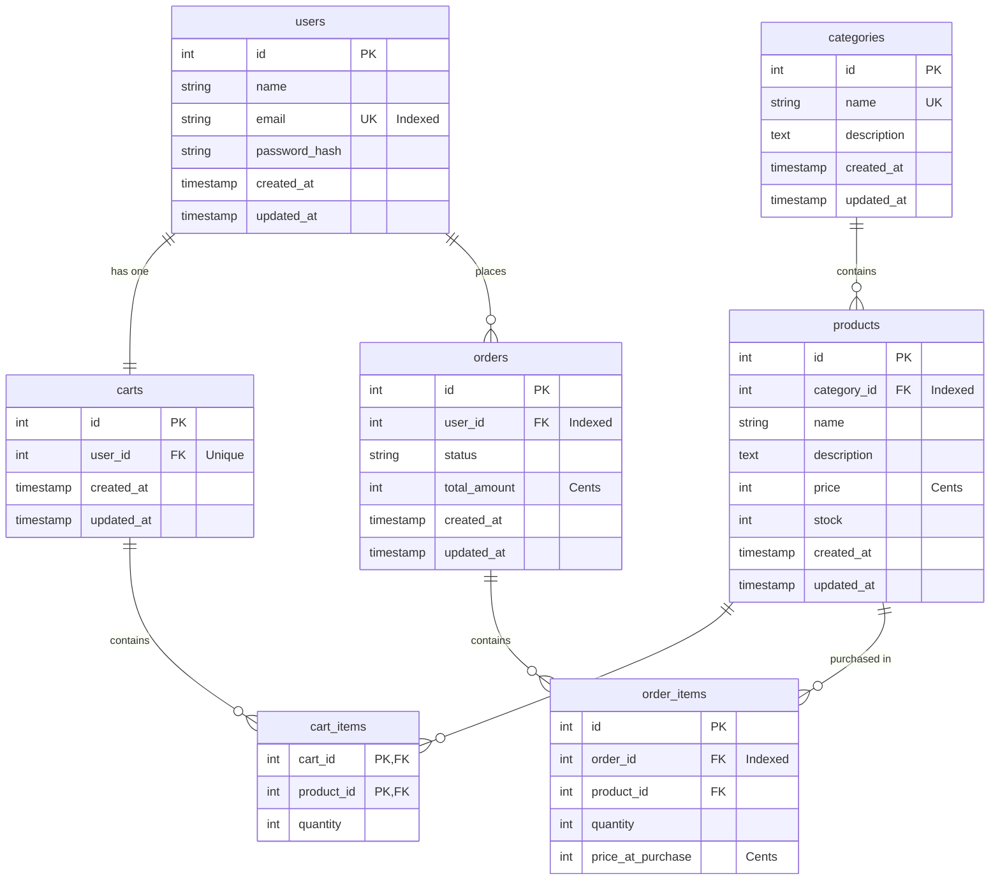

# Database Design

This document details the database schema design, index choices, relationships, and contains the Entity Relationship (ER) diagram for PostgreSQL.

## Entity Relationship (ER) Diagram



---

## Table Definitions (DDL)

### Users
Stores customer authentication and profile details.
```sql
CREATE TABLE users (
    id SERIAL PRIMARY KEY,
    name VARCHAR(255) NOT NULL,
    email VARCHAR(255) UNIQUE NOT NULL,
    password_hash VARCHAR(255) NOT NULL,
    created_at TIMESTAMP WITH TIME ZONE DEFAULT CURRENT_TIMESTAMP,
    updated_at TIMESTAMP WITH TIME ZONE DEFAULT CURRENT_TIMESTAMP
);
CREATE INDEX idx_users_email ON users(email);
```

### Categories
Categorizes catalog items.
```sql
CREATE TABLE categories (
    id SERIAL PRIMARY KEY,
    name VARCHAR(100) UNIQUE NOT NULL,
    description TEXT,
    created_at TIMESTAMP WITH TIME ZONE DEFAULT CURRENT_TIMESTAMP,
    updated_at TIMESTAMP WITH TIME ZONE DEFAULT CURRENT_TIMESTAMP
);
```

### Products
Stores catalog products and their stock count.
```sql
CREATE TABLE products (
    id SERIAL PRIMARY KEY,
    category_id INTEGER NOT NULL REFERENCES categories(id) ON DELETE RESTRICT,
    name VARCHAR(255) NOT NULL,
    description TEXT,
    price INT NOT NULL CHECK (price > 0), -- Stored in cents
    stock INT NOT NULL DEFAULT 0 CHECK (stock >= 0),
    created_at TIMESTAMP WITH TIME ZONE DEFAULT CURRENT_TIMESTAMP,
    updated_at TIMESTAMP WITH TIME ZONE DEFAULT CURRENT_TIMESTAMP
);
CREATE INDEX idx_products_category_id ON products(category_id);
```

### Carts & Cart Items
Stores customer's active shopping cart session. A user has exactly one cart.
```sql
CREATE TABLE carts (
    id SERIAL PRIMARY KEY,
    user_id INTEGER UNIQUE NOT NULL REFERENCES users(id) ON DELETE CASCADE,
    created_at TIMESTAMP WITH TIME ZONE DEFAULT CURRENT_TIMESTAMP,
    updated_at TIMESTAMP WITH TIME ZONE DEFAULT CURRENT_TIMESTAMP
);

CREATE TABLE cart_items (
    cart_id INTEGER NOT NULL REFERENCES carts(id) ON DELETE CASCADE,
    product_id INTEGER NOT NULL REFERENCES products(id) ON DELETE CASCADE,
    quantity INTEGER NOT NULL CHECK (quantity > 0),
    PRIMARY KEY (cart_id, product_id)
);
```

### Orders & Order Items
Stores purchase invoice history. Price of products at purchase time is recorded to handle price changes.
```sql
CREATE TABLE orders (
    id SERIAL PRIMARY KEY,
    user_id INTEGER NOT NULL REFERENCES users(id) ON DELETE RESTRICT,
    status VARCHAR(50) NOT NULL, -- e.g., PENDING, PAID, CANCELLED
    total_amount INT NOT NULL CHECK (total_amount >= 0), -- Stored in cents
    created_at TIMESTAMP WITH TIME ZONE DEFAULT CURRENT_TIMESTAMP,
    updated_at TIMESTAMP WITH TIME ZONE DEFAULT CURRENT_TIMESTAMP
);
CREATE INDEX idx_orders_user_id ON orders(user_id);

CREATE TABLE order_items (
    id SERIAL PRIMARY KEY,
    order_id INTEGER NOT NULL REFERENCES orders(id) ON DELETE CASCADE,
    product_id INTEGER NOT NULL REFERENCES products(id) ON DELETE RESTRICT,
    quantity INTEGER NOT NULL CHECK (quantity > 0),
    price_at_purchase INTEGER NOT NULL CHECK (price_at_purchase > 0) -- Stored in cents
);
CREATE INDEX idx_order_items_order_id ON order_items(order_id);
```
